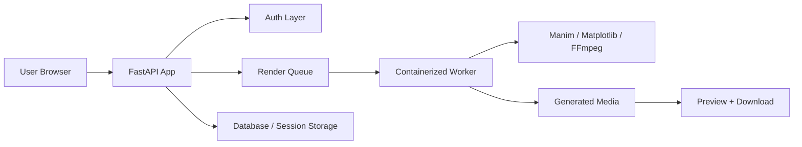

<p align="center">
  
</p>

<p align="center">
  <strong>A high-performance, containerized cloud platform for real-time Manim math animations, Matplotlib plots, and dynamic interactive charts.</strong>
</p>

<p align="center">
  <a href="https://renderora.onrender.com">
    
  </a>
  <a href="https://github.com/jawadahmadliaqat-dot/Renderora">
    
  </a>
  
  
  
</p>

---

## 📌 Table of Contents

- [Overview](#-overview)
- [Key Features](#-key-features)
- [Live Demo & Cloud Access](#-live-demo--cloud-access)
- [System Architecture](#-system-architecture)
- [Core Templates & Examples](#-core-templates--examples)
- [Tech Stack](#-tech-stack)
- [REST API Specification](#-rest-api-specification)
- [Local Development & Docker Setup](#-local-development--docker-setup)
- [Deployment Guide](#-deployment-guide)
- [Troubleshooting & Performance](#-troubleshooting--performance)
- [Contributing](#-contributing)
- [License](#-license)

---

## ⚡ Overview

**Renderora** is an end-to-end cloud-native studio designed for students, educators, software engineers, and content creators. It eliminates the hassle of configuring complex local LaTeX, FFmpeg, and Python environments by shifting video rendering and mathematical plotting into an accessible web platform.

Powered by a containerized **FastAPI** backend and an **in-browser Monaco-style editor**, users can seamlessly write **Manim (Community Edition)** code, synthesize **Matplotlib** graphics, or manipulate real-time **Chart.js** telemetry feeds.

---

## ✨ Key Features

- **🌐 Live Cloud Rendering Engine:** Offloads resource-heavy mathematical video encoding (Manim) and image generation (Matplotlib) to cloud servers.
- **🐳 Fully Containerized (Docker):** Bundles FFmpeg, Cairo, LaTeX dependencies, and Python runtimes for deterministic execution across environments.
- **👨‍💻 Modern Web Editor Studio:**
  - Dynamic line numbering & scroll-sync.
  - Quick render shortcut (`Ctrl + Enter` / `Cmd + Enter`).
  - Auto-persisting draft storage via `localStorage`.
  - Mobile-responsive layout switching between Editor & Preview viewports.
- **📊 Real-time Interactive Control Panel:** Live parameter sliders (Frequency, Amplitude) bound to dynamic client-side telemetry rendering via Chart.js.
- **🔑 Google OAuth Single Sign-On:** Pre-integrated authentication pipeline to manage access controls before dispatching heavy computation workloads.
- **📥 One-Click Export:** Native streaming media previews with instant high-speed file download handlers for MP4 videos and PNG figures.

---

## 🚀 Live Demo & Cloud Access

The platform is deployed and live on Render Cloud Infrastructure:

- **🌐 Web Platform App:** [https://renderora.onrender.com](https://renderora.onrender.com)
- **📚 Interactive API Docs (Swagger):** [https://renderora.onrender.com/docs](https://renderora.onrender.com/docs)
- **📖 Alternative Docs (ReDoc):** [https://renderora.onrender.com/redoc](https://renderora.onrender.com/redoc)

> 💡 **Free Instance Notice:** The server instance automatically spins down during periods of inactivity. If accessing after a pause, please allow **30–50 seconds** for the cloud container to initialize.

---

## 🏗️ System Architecture



### Core Flow

1. User writes code in the browser editor.
2. Frontend serializes the request and sends it to the API.
3. FastAPI validates the task and queues the render job.
4. A container-based worker executes Manim or plotting logic.
5. Final output is stored and visually returned to the user.

---

## 🧩 Core Templates & Examples

Renderora is designed around reusable, production-grade templates for common creative and educational workflows.

### Manim Templates

- **Math Animation**: geometric transformations, vector explanations, calculus animations.
- **Physics Visuals**: motion diagrams and simulation-based scenes.
- **Classroom Explainers**: step-by-step educational walkthroughs.

### Plotting Templates

- **Static Figures**: bar charts, line graphs, scatter plots.
- **Dynamic Data Stories**: charts tied to interactive UI controls.
- **Scientific Visualization**: function curves and parameterized formulas.

### Example Workflows

- Generate a sine-wave animation with live amplitude controls.
- Create a geometry proof with step-by-step transitions.
- Render a statistical chart from user-defined data inputs.

---

## 🛠️ Tech Stack

### Frontend

- HTML5 / CSS3 / JavaScript
- Chart.js
- Monaco-inspired editor experience
- Responsive single-page layout

### Backend

- Python 3.9+
- FastAPI
- SQLAlchemy / SQLite
- Pydantic validation

### Rendering Engine

- Manim Community Edition
- Matplotlib
- FFmpeg
- Cairo / LaTeX dependencies
- Docker runtime isolation

---

## 📡 REST API Specification

Renderora exposes a clean API surface for generating videos, plots, and previews.

### Common Endpoints

| Method | Endpoint | Description |
| --- | --- | --- |
| GET | `/` | Home page or metadata endpoint |
| POST | `/render` | Submit a render job |
| GET | `/status/{job_id}` | Check render progress |
| GET | `/media/{file_name}` | Retrieve rendered output |
| GET | `/docs` | Swagger UI |
| GET | `/redoc` | ReDoc UI |

### Example Request

```json
{
  "code": "from manim import *\nclass MyScene(Scene):\n    def construct(self):\n        self.play(Create(Circle()))",
  "format": "mp4",
  "params": {
    "fps": 60,
    "quality": "high"
  }
}
```

### Example Response

```json
{
  "job_id": "a12b34cd",
  "status": "queued",
  "message": "Render request accepted and scheduled."
}
```

---

## 🧪 Local Development & Docker Setup

### Prerequisites

- Python 3.9+
- Docker & Docker Compose
- FFmpeg
- LaTeX tools for Manim rendering
- Git

### 1) Clone the repository

```bash
git clone https://github.com/jawadahmadliaqat-dot/Renderora.git
cd Renderora
```

### 2) Set up a virtual environment

```bash
python -m venv .venv
source .venv/bin/activate  # Linux/macOS
.venv\Scripts\activate     # Windows
```

### 3) Install dependencies

```bash
pip install -r requirements.txt
```

### 4) Run the app locally

```bash
python app.py
```

or

```bash
uvicorn app:app --reload
```

### 5) Docker deployment

```bash
docker build -t renderora .
docker run -p 8000:8000 renderora
```

Access the project at:

- `http://localhost:8000`
- `http://localhost:8000/docs`

---

## 🚀 Deployment Guide

### Render Deployment

1. Push the repository to GitHub.
2. Create a new **Render** web service.
3. Connect the repository.
4. Set the runtime to Python.
5. Use the app entrypoint accordingly.
6. Add required environment variables such as `SECRET_KEY`, OAuth credentials, and storage configuration.
7. Deploy and monitor logs.

### Production Recommendations

- Add rate limiting for render workloads.
- Use queue workers for long-running tasks.
- Store generated media in persistent object storage.
- Configure HTTPS and secure session cookies.
- Set resource limits for Docker containers.

---

## ⚙️ Troubleshooting & Performance

### Common Issues

- **Rendering hangs:** Check FFmpeg and LaTeX installation.
- **Slow generation:** Reduce frame count or increase worker capacity.
- **Blank preview:** Confirm media output path exists and is writable.
- **Authentication errors:** Validate OAuth credentials and redirect URIs.
- **Large output files:** Use compression or cleanup policies.

### Performance Tips

- Keep render workers isolated per task.
- Use asynchronous processing for heavier jobs.
- Cache repeated templates and static assets.
- Limit concurrent jobs on free-tier infrastructure.

---

## 🤝 Contributing

Contributions are welcome from developers, educators, and creative technologists.

### How to contribute

1. Fork the repository.
2. Create a feature branch.
3. Make your changes and test locally.
4. Submit a clean pull request with a clear explanation.

### Suggested areas for contribution

- Better media export pipelines
- More animation templates
- Improved analytics and telemetry
- UI refinements and accessibility improvements
- More robust Docker and deployment automation

---

## 📄 License

This project is released under an open-source license. Please review the repository license and usage terms before commercial deployment.

---

<p align="center">
  
</p>

<p align="center">
  <strong>Built for creators, educators, and engineers who want beautiful math visuals and real-time rendered storytelling.</strong>
</p>
